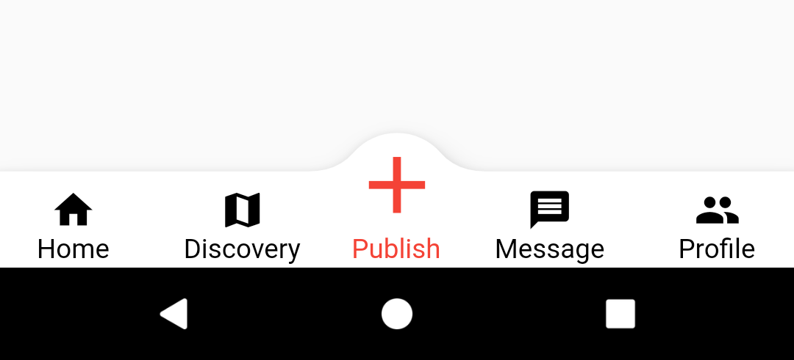

# convex_bottom_bar|[English](README.md)

`convex_bottom_bar`扩展包基于Flutter的BottomAppBar，实现了对凸起Tab的支持，预览效果如下图所示。

> 当前BottomAppBar默认的效果只能实现凹口的FAB，很多时候设计要求的是凸起F效果。



## 使用
执行以下步骤，完成对`Scaffold`的个性化配置：
1. 添加FAB按钮
2. 使FAB居中展示
3. 添加AppBar按钮

### 添加FAB按钮
FAB，实现一个带图片文字的控件。

```dart
floatingActionButton: GestureDetector(
  onTap: () => _onItemTapped(INDEX_PUBLISH),
  child: Container(
    width: 60,
    height: 80,
    padding: EdgeInsets.only(bottom: 2),
    child: Column(
      mainAxisAlignment: MainAxisAlignment.end,
      children: <Widget>[
        Icon(Icons.add, size: 50, color: convexColor),
        Text('Publish', style: TextStyle(color: convexColor)),
      ],
    ),
  ),
)
```
### 使FAB居中展示
使FAB相对于BottomApp居中展示。

```dart
floatingActionButtonLocation: ExtendLocation.centerDocked,
```
### 添加AppBar按钮

```dart
bottomNavigationBar: ConvexAppBar.builder(
  count: 5,
  builder: (BuildContext context, int index) {
    var data = _navigationItems[index];
    var color = _selected == index ? Colors.red : Colors.black;
    return GestureDetector(
      onTap: () => _onItemTapped(index),
        child: Container(
           height: 50,
           padding: EdgeInsets.only(bottom: 2),
           child: Column(
             mainAxisAlignment: MainAxisAlignment.end,
             children: <Widget>[
               Icon(data.icon, color: color),
               Text(data.title, style: TextStyle(color: color))
             ],
           )));
    }),
```

## 示例
完整细节请参考示例工程[example](example)。

## 帮助

查阅[Flutter在线文档](https://flutter.dev/docs)上手Flutter开发。
