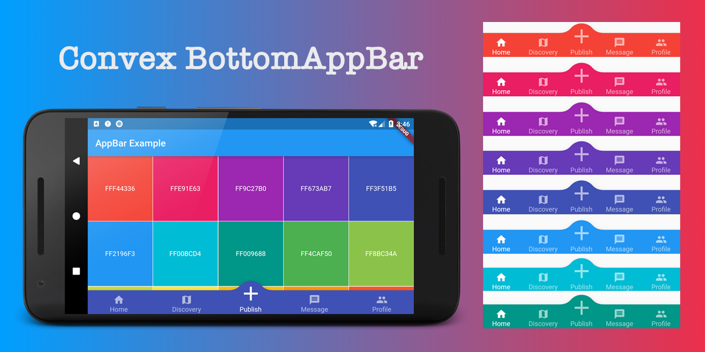
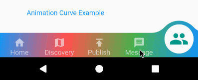
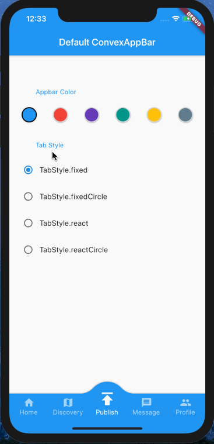

# convex_bottom_bar

[](https://pub.dartlang.org/packages/convex_bottom_bar)
[](https://github.com/hacktons/convex_bottom_bar)
[](https://codemagic.io/apps/5db10f597d3edb001a6ede16/5db10f597d3edb001a6ede15/latest_build)

The official BottomAppBar can only display a notch FAB with app bar, sometimes we need a convex FAB. This ConvexAppBar is inspired by BottomAppBar and NotchShape's implementation.

Example can be found at [http://hacktons.cn/convex_bottom_bar](http://hacktons.cn/convex_bottom_bar)  
>Based on flutter-web and github-pages

Here are some supported style:

|            **fixed**             |            **react**             |
| :------------------------------: | :------------------------------: |
|         |         |
|         **fixedCircle**          |         **reactCircle**       |
|  |  |
|            **flip**              |          **titled**          |
|          |        |
|            **textIn**            |   **tab image**          |
|   |        |
|      **gradient backgound**    |      **badge chip**         |
|      |        |


## How to use
Typically ConvexAppBar can work with `Scaffold` by setup its `bottomNavigationBar`.

The `ConvexAppBar` has to two constructors, the `ConvexAppBar()` will use default style to simplify the tab creation.

Add this to your package's pubspec.yaml file, use the [latest version](https://pub.dev/packages/convex_bottom_bar#-installing-tab-):

```yaml
dependencies:
  convex_bottom_bar: ^1.4.0
```

```dart
import 'package:convex_bottom_bar/convex_bottom_bar.dart';

Scaffold(
  bottomNavigationBar: ConvexAppBar(
    items: [
      TabItem(icon: Icons.home, title: 'Home'),
      TabItem(icon: Icons.map, title: 'Discovery'),
      TabItem(icon: Icons.add, title: 'Add'),
      TabItem(icon: Icons.message, title: 'Message'),
      TabItem(icon: Icons.people, title: 'Profile'),
    ],
    style: _style.value,
    curve: _curve.value,
    backgroundColor: _babColor,
    onTap: (int i) => setState(() {
      _selectedIndex = i;
    }),
  )
);
```

## Table of contents

- [Badge](#badge)

- [Theming](#theming)

- [Custom Example](#custom-example)

- [Contribution](#contribution)

- [Help](#help)

## Badge
If you need to add badge on the tab, use `ConvexAppBar.chip` to get it done. 

[](doc/badge-demo.mp4 "badge demo")

```dart
ConvexAppBar.chip({3: '99+', 4: Icons.assistant_photo, 2: Colors.redAccent});
```

The `chip` method accept an array of badge; The `badge` is map with tab items, each value of entry can be either `String`, `IconData`, `Color` or `Widget`. 

## Theming
The bar will use default style, you may want to theme it. Here are some supported attributes:


| Attributes      | Description                           |
| --------------- | ------------------------------------- |
| backgroundColor | AppBar background                     |
| gradient        | gradient will override backgroundColor|
| height          | AppBar height                         |
| color           | tab icon/text color                   |
| activeColor     | tab icon/text color **when selected** |
| curveSize       | size of the convex shape              |
| top   | top edge of the convex shape relative to AppBar |
| style | style to describe the convex shape: **fixed, fixedCircle, react, reactCircle**, ... |
| chipBuilder | custom badge builder, use ConvexAppBar.chip for default badge |



## Custom Example

If the default style does not match with your situation， try with `ConvexAppBar.builder()`, which allow you to custom nearly all the tab features.

```dart
Scaffold(
  bottomNavigationBar: ConvexAppBar.builder(
    count: items.length,
    backgroundColor: _tabBackgroundColor,
    style: TabStyle.fixed,
    itemBuilder: _CustomBuilder(items, _tabBackgroundColor),
  )
);
```
## FAQ

* [Using an image instead of an icon for actionItem](doc/issue-image-for-actionitem.md)
* [Is there anyway to remove elevation in the bottom bar?](doc/issue-remove-elevation.md) 

## Contribution
Please file feature requests and bugs at the [issue tracker](https://github.com/hacktons/convex_bottom_bar/issues).

## Help
For more detail, please refer to the [example](example) project.