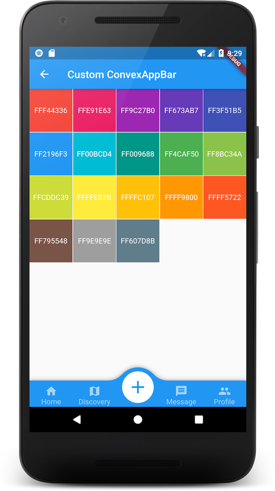

Language: [English](README.md) | [中文简体](README-zh.md)

# convex_bottom_bar

The official BottomAppBar can only display a notch FAB with app bar, sometimes we need a convex FAB. This ConvexAppBar is inspired by BottomAppBar and NotchShape's implementation.


**Install Demo** [app-release.apk](doc/app-release.apk)

## How to use
Typically ConvexAppBar can work with `Scaffold` by setup its `bottomNavigationBar`.

The `ConvexAppBar` has to two constructors, the `ConvexAppBar()` will use default style to simplify the tab creation.

Add this to your package's pubspec.yaml file, use the [latest version](https://pub.dev/packages/convex_bottom_bar#-installing-tab-):

```yaml
dependencies:
  convex_bottom_bar: ^0.0.1
```

```dart
import 'package:convex_bottom_bar/convex_bottom_bar.dart';

Scaffold(
  bottomNavigationBar: ConvexAppBar(
    items: TAB_ITEMS,
    onTap: (int i) => setState(() {
      _selectedIndex = i;
    }),
    actionItem: const TabItem(icon: Icons.add, title: "Publish"),
    onTapActionButton: () => setState(() {
      _selectedIndex = -1;
    }),
  ),
);
```

## Table of contents

- [Theming](#theming)

- [Custom Example](#custom-example)

- [Contribution](#contribution)

- [Help](#help)

## Theming
The bar will use default style, you may want to theme it. Here are some supported attributes:


| Attributes      | Description                           |
| --------------- | ------------------------------------- |
| backgroundColor | AppBar background                     |
| height          | AppBar height                         |
| color           | tab icon/text color                   |
| activeColor     | tab icon/text color **when selected** |
| curveSize       | size of the convex shape              |
| top   | top edge of the convex shape relative to AppBar |


## Custom Example
If the default style does not match with your situation， try with `ConvexAppBar.builder()`, which allow you to custom nearly all the tab features.

Here is a custom sample:


```dart
Scaffold(
  bottomNavigationBar: ConvexAppBar.builder(
    count: items.length,
    backgroundColor: _tabBackgroundColor,
    tabBuilder: (BuildContext context, int index, bool active) {
      var navigationItem = items[index];
      var _color = active ? Colors.white : Colors.white60;
      var _icon = active
          ? navigationItem.activeIcon ?? navigationItem.icon
          : navigationItem.icon;
      return Container(
        color: Colors.transparent,
        padding: EdgeInsets.only(bottom: 2),
        child: Column(
          mainAxisAlignment: MainAxisAlignment.end,
          children: <Widget>[
            Icon(_icon, color: _color),
            Text(navigationItem.title, style: TextStyle(color: _color))
          ],
        ),
      );
    },
    actionBuilder: (BuildContext context, int index, bool active) {
      var _color = active ? Colors.white : Colors.white60;
      return Stack(
        alignment: Alignment.center,
        children: <Widget>[
          SizedBox(
            width: 60,
            height: 60,
            child: Container(
              decoration:
                  BoxDecoration(shape: BoxShape.circle, color: _color),
              child: Icon(
                Icons.add,
                size: 40,
                color: _tabBackgroundColor,
              ),
            ),
          )
        ],
      );
    },
  ),
);
```

## Contribution
Please file feature requests and bugs at the [issue tracker](https://github.com/hacktons/convex_bottom_bar/issues).

## Help
For more detail, please refer to the [example](example) project.
