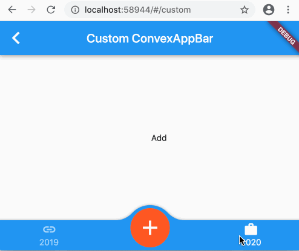

# How to block tab event?
The ConvexAppBar is similar to BottomAppBar, however there are something different, for example you can not float the notch button or handle the tab event separately.

We can distinguish the tab by index of item. Or use a `onTabNotify` to block the tap event.
In this case the tab state won't change, they will remain as tap event never happened.

> Original designed for [#issue 98](https://github.com/hacktons/convex_bottom_bar/issues/98)

## Sample


```dart
DefaultTabController(
  length: items.length,
  child: Scaffold(
    appBar: AppBar(title: const Text('Custom ConvexAppBar')),
    body: TabBarView(
      physics: NeverScrollableScrollPhysics(),
      children: items.map((i) => Center(child: Text(i.title))).toList(),
    ),
    bottomNavigationBar: ConvexAppBar(
      style: TabStyle.fixedCircle,
      items: [
        TabItem(title: '2019', icon: Icons.link),
        TabItem(
            icon: Container(
              decoration: BoxDecoration(
                shape: BoxShape.circle,
                color: Color(0xFFFF5722),
              ),
              child: Icon(Icons.add, color: Colors.white, size: 40),
            )),
        TabItem(title: "2020", icon: Icons.work),
      ],
      onTabNotify: (i) {
        var intercept = i == 1;
        if (intercept) {
          Navigator.pushNamed(context, '/fab');
        }
        return !intercept;
      },
      onTap: (i) => debugPrint('click $i'),
    ),
))
```
